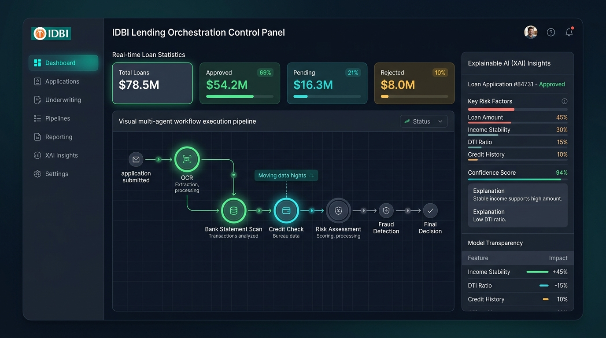
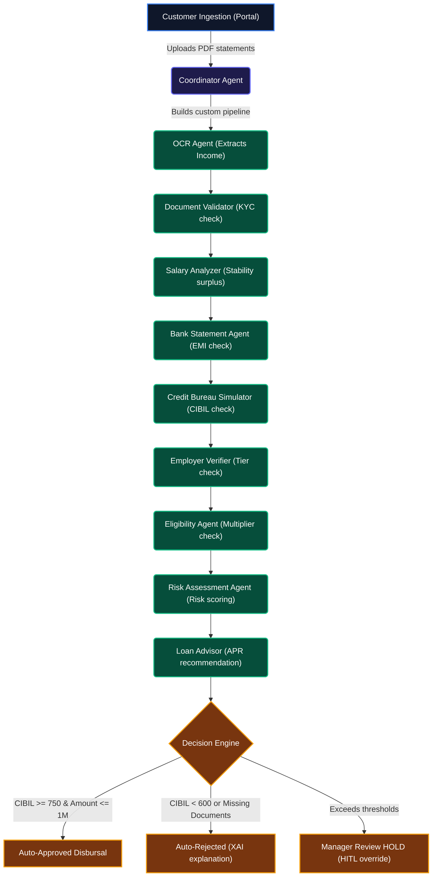

# IDBI Lending Orchestration Control Panel (ISLO-AI)
## Prototype Mockup Screen & Architectural Diagram

Here is the high-fidelity UI prototype screenshot and architectural diagram designed for your hackathon submission.

---

### 🎨 Prototype Dashboard Mockup (16:9 Screen)
This mockup represents the premium dark-mode decision intelligence interface. It utilizes a deep slate/midnight-blue background overlayed with subtle grids to reduce banker fatigue, highlighted by glowing status indicators (emerald green, teal, and amber) to emphasize pipeline progression.

---

### ⚙️ Multi-Agent Decision Workflow Diagram
The following diagram maps the precise data flow from the moment a customer uploads verification files in the portal to the final automated or manual sign-off decision.

---

### 🔍 Background & Vibe Critique
*   **The Theme**: The dark-slate gradient (`from-slate-950 via-slate-900 to-slate-950`) combined with emerald green accents provides a highly premium "tech-first" banking aesthetic. It mimics modern trading terminals rather than old-fashioned white dashboard templates.
*   **The Grid Overlay**: The clean grid borders (`border-slate-800`) are light enough to separate widgets without creating clutter.
*   **Recommendation**: The current background color hierarchy is excellent. We recommend keeping the deep slate background as it makes the glowing timeline nodes (in progress, completed, failed) pop visually, guiding the viewer's eye straight to the decision path.
