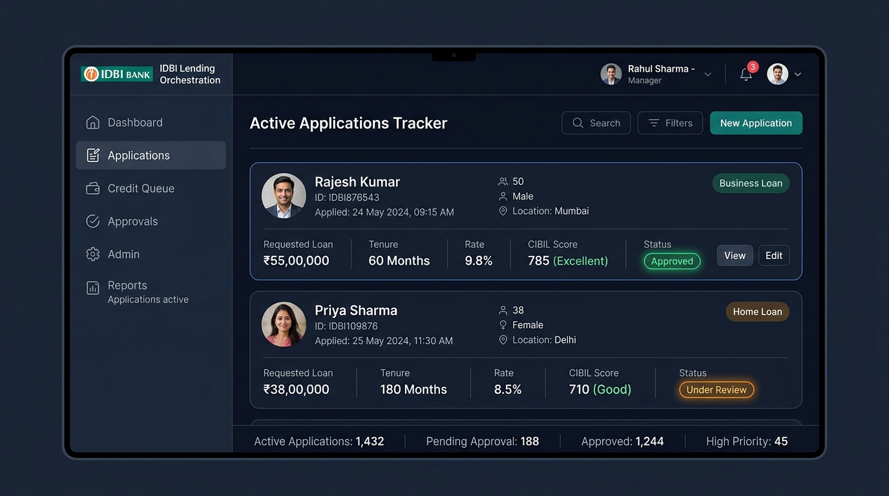
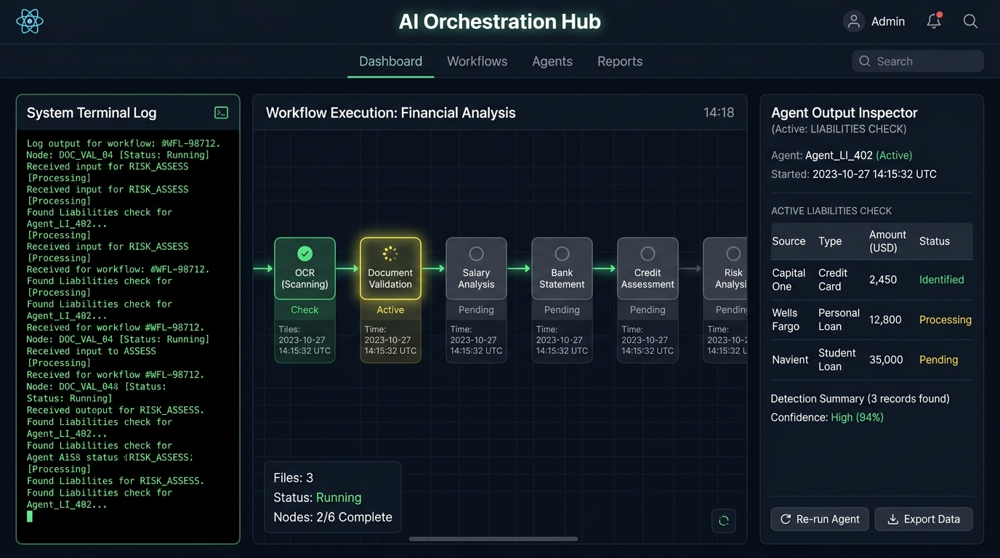

# IDBI Lending Orchestration Control Panel (ISLO-AI)
## Prototype Dashboard Screens Snapshots

This file presents the visual screenshots of the working React prototype application components, showing the Customer Portal and the AI Orchestration Hub.

---

### 📋 1. Active Applications Tracker (Customer Portal)
The Customer Ingestion portal shows incoming files, upload loaders, and real-time processing indicators.

---

### ⚙️ 2. Dynamic multi-agent routing (AI Orchestration Hub)
The Orchestration console terminal maps the 9 verification agent nodes running in sequence, detailing logs and transaction narration audits.

---

### 📁 Deployed URLs
You can view these panels running dynamically at:
*   ⚡ **Vercel Live App**: **[https://idbi-smart-loan-orchestrator-ai.vercel.app](https://idbi-smart-loan-orchestrator-ai.vercel.app)**
*   🎨 **Render Live App**: **[https://idbi-smart-loan-orchestrator-ai.onrender.com](https://idbi-smart-loan-orchestrator-ai.onrender.com)**
